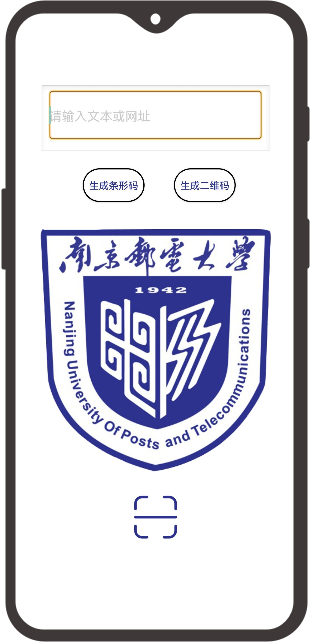
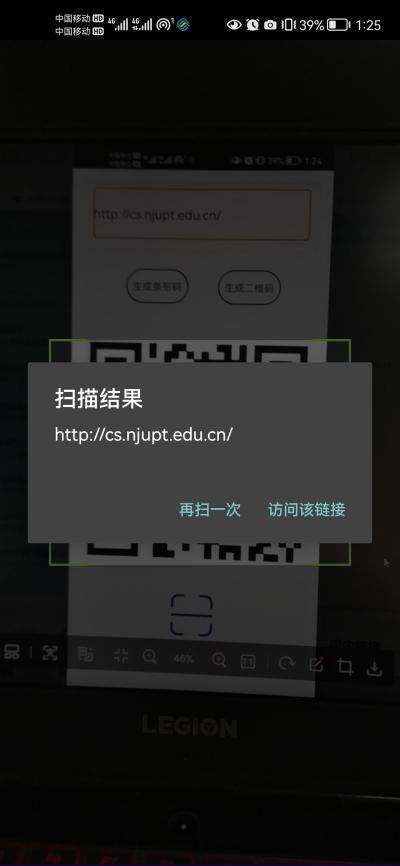
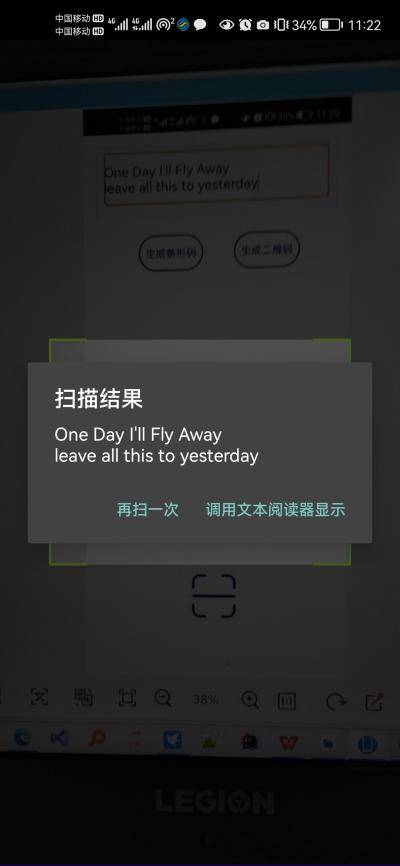

# 二维码系统
## 1.项目背景
本项目源于南京邮电大学嵌入式手机终端开发技术课程大作业题目——二维码系统。
> 课题要求如下：
>* 要求能够通过文字或网页地址生成二维码图片，该生成的二维码图片中央需包含一个小的南邮图徽；
>* 能够扫描1生成的二维码或其他二维码图片，获取文本信息；
>* 通过上述2获取的文本信息进行自动判断是否是文本信息，或是网页浏览；
>* 如果上述3中是文本，则调用Android文本阅读器显示；如果是网页链接，需启动浏览器进行访问；
>* 上述功能需要在Android智能手机上实现演示；
>* 通过二维码支持扩展至一维码支持。
## 2.安装和使用
>JDK1.8版本,在Android Studio最新版本打开该项目即可
## 3.功能特性

## 4.可考虑增加功能
>* 与支付宝或微信支付建立链接，实现付款功能；
>* 增加可扫描图库中图片的功能
>* 优化相机聚焦能力，改善用户体验
## License
[NJUPT](LICENSE) © Xiao ADi
## Contact
QQ @1712318665@qq.com

